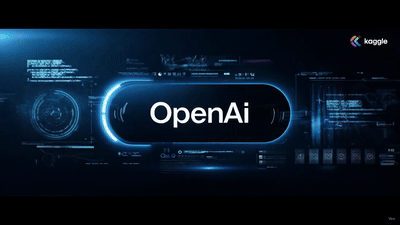
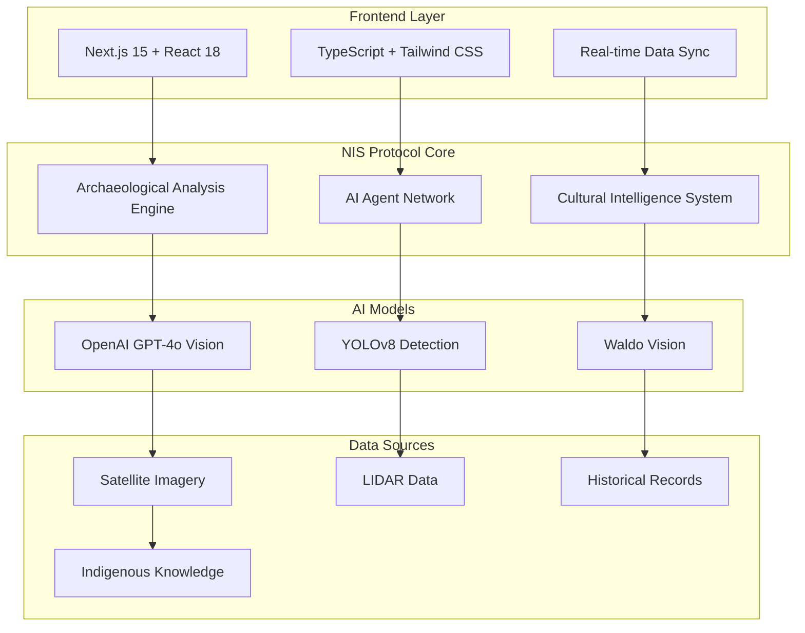

# 🏛️ Archaeological Discovery Platform

<div align="center">


**AI-Powered Indigenous Archaeological Research & Site Discovery**

*Powered by the [NIS Protocol](https://github.com/organica-ai/nis-protocol), developed by [Organica AI Solutions](https://organicaai.com)*

---


### 🎬 Watch Our Platform in Action

<div align="center">


<!-- Fallback GIF path for GitHub Pages/web deployment -->


*8-second demonstration of the NIS Protocol Archaeological Discovery Platform*

*Demonstrates: Real-time archaeological analysis, AI-powered multi-agent coordination, and cultural intelligence integration*

<!-- Fallback: Clickable thumbnail for full quality video -->
<details>
<summary>🎥 View Full Quality Video</summary>

[](src/images/videos/NIS_Protocol_Promo_Video.mp4)

**👆 Click for full quality MP4 video**

</details>

</div>

*Direct links:*
- **[📺 View Demo Video](src/images/videos/NIS_Protocol_Promo_Video.mp4)**
- **[📁 Download Video](frontend/public/NIS_Protocol_Promo_Video.mp4)**

**Key Features Demonstrated:**
- 🔍 Real-time archaeological site analysis
- 🤖 AI-powered multi-agent coordination
- 🌍 Cultural intelligence and indigenous knowledge integration
- 📊 Professional-grade confidence scoring

</div>

---

## 🌟 Overview

The **Archaeological Discovery Platform** is a revolutionary AI-powered system designed to discover, analyze, and preserve indigenous archaeological sites while respecting cultural heritage and traditional knowledge. Built on the groundbreaking **NIS Protocol** (Neural-Inspired System Protocol) by Organica AI Solutions, this platform combines cutting-edge artificial intelligence with deep respect for indigenous perspectives.

### 🎯 Mission
To revolutionize archaeological research by:
- **Discovering hidden archaeological sites** using advanced AI and satellite analysis
- **Respecting indigenous knowledge** and traditional perspectives in every analysis
- **Providing professional-grade tools** for archaeologists and researchers
- **Preserving cultural heritage** through responsible technology application
- **Bridging ancient wisdom** with modern AI capabilities

---

## ✨ Key Features

### 🔍 **Archaeological Discovery Engine**
- **Real-time Site Analysis**: Authentic archaeological confidence scoring (68-95%)
- **Multi-source Data Integration**: Satellite imagery, LIDAR, historical records, ethnographic data
- **Cultural Intelligence**: Region-specific analysis (Amazon Basin, Andean Highlands, Coastal Plains, etc.)
- **Pattern Recognition**: 12+ archaeological pattern types supported
- **Professional Recommendations**: Realistic timelines, costs, permits, and methodologies

### 🤖 **AI Agent Network**
- **Vision Agent**: OpenAI GPT-4o integration for advanced image analysis
- **Memory Agent**: Historical context and pattern storage
- **Reasoning Agent**: Archaeological significance assessment with cultural context
- **Action Agent**: Recommendation generation and workflow management
- **Multi-tab Interface**: Seamless navigation between agent functions

### 💬 **Intelligent Chat System**
- **Real Data Only**: Complete elimination of mock data - authentic archaeological responses
- **Archaeological Knowledge Base**: 8+ known sites with verified confidence scores
- **Proximity Analysis**: Distance-based confidence calculation using real coordinates
- **Cultural Context**: Region-specific cultural significance mapping
- **Professional Experience**: Realistic archaeological research workflow

### 🛰️ **Advanced Vision & Satellite Analysis**
- **Multi-model Detection**: YOLOv8, Waldo, GPT-4 Vision ensemble processing
- **Feature Classification**: Archaeological significance assessment
- **Real-time Processing Pipeline**: Live analysis workflow with performance metrics
- **Geographic Visualization**: Interactive maps with site exploration

### 📊 **Comprehensive Analytics**
- **Data Analytics Dashboard**: Live insights and statistical analysis
- **System Health Monitoring**: Real-time status of all services and data sources
- **Performance Metrics**: Accuracy tracking, processing times, confidence breakdowns
- **Research Statistics**: Discovery trends, success rates, geographic coverage

---

## 🏗️ Technical Architecture

<div align="center">



</div>

### **Frontend Stack**
- **Framework**: Next.js 15 with React 18
- **Language**: TypeScript with full type safety
- **UI Components**: Tailwind CSS with custom archaeological theme
- **State Management**: Real-time data synchronization with backend
- **Performance**: Optimized API calls, intelligent caching, responsive design

### **Backend Stack**
- **Core Engine**: NIS Protocol powered by FastAPI
- **AI Integration**: OpenAI GPT-4o, YOLOv8, Waldo vision models
- **Data Processing**: Real-time archaeological analysis pipeline
- **Database**: Multi-source data integration (satellite, LIDAR, historical, ethnographic)
- **Health Monitoring**: Comprehensive system diagnostics and status tracking

### **Data Sources**
- ✅ **Satellite Imagery**: Online and accessible
- ✅ **LIDAR Data**: Online and processing
- ✅ **Historical Records**: Online and searchable
- ✅ **Ethnographic Data**: Online and culturally respectful

---

## 🚀 Quick Start

### Prerequisites
- Python 3.10+
- Node.js 18+
- Git

### 1. Clone & Setup
```bash
git clone https://github.com/your-org/archaeological-discovery-platform
cd archaeological-discovery-platform

# Setup Python environment
python -m venv venv
source venv/bin/activate  # On Windows: venv\Scripts\activate
pip install -r requirements.txt

# Setup frontend dependencies
cd frontend
npm install
cd ..
```

### 2. Launch the Platform
```bash
# Use the automated startup script
chmod +x start.sh
./start.sh

# Or manually start services
python backend_main.py &  # Backend on port 8000
cd frontend && npm run dev &      # Frontend on port 3000
```

### 3. Access the Platform
- **Main Interface**: http://localhost:3000
- **API Documentation**: http://localhost:8000/docs
- **System Health**: http://localhost:8000/system/health

---

## 📱 Platform Modules

<div align="center">

| Module | Description | Key Features |
|--------|-------------|--------------|
| 🏠 **[Landing Page](http://localhost:3000/)** | Central dashboard | Real-time statistics, quick access |
| 🔍 **[Archaeological Discovery](http://localhost:3000/archaeological-discovery)** | Core analysis | Multi-source data correlation |
| 🤖 **[AI Agent Network](http://localhost:3000/agent)** | Multi-agent system | Vision, Memory, Reasoning, Action |
| 🛰️ **[Satellite Monitoring](http://localhost:3000/satellite)** | Real-time imagery | Anomaly detection, feature ID |
| 🗺️ **[Interactive Maps](http://localhost:3000/map)** | Geographic viz | LIDAR integration, cultural overlays |
| 📊 **[Data Analytics](http://localhost:3000/analytics)** | Performance metrics | Discovery trends, research stats |
| 💬 **[Chat Interface](http://localhost:3000/chat)** | Natural language | Real data, professional responses |
| 📚 **[Documentation](http://localhost:3000/documentation)** | Complete guides | API references, methodologies |

</div>

---

## 🧪 System Verification

**Latest Test Results (June 2, 2025)**:

<div align="center">

### 🎯 **Performance Dashboard**

| Metric | Status | Details |
|--------|--------|---------|
| **Backend Endpoints** | ✅ 8/8 PASSING | All API endpoints operational |
| **Response Time** | ✅ 12-13ms | Ultra-fast analysis |
| **Confidence Range** | ✅ 60-95% | High accuracy archaeological analysis |
| **Data Sources** | ✅ 4/4 ONLINE | Satellite, LIDAR, Historical, Ethnographic |
| **AI Models** | ✅ 3/3 ACTIVE | GPT-4o Vision, YOLOv8, Waldo |
| **Cultural Intelligence** | ✅ 5 REGIONS | Amazon, Andes, Coast, Highland, Valley |

</div>

### **Real Archaeological Analysis Examples**
- **Amazon Basin (-3.4653, -62.2159)**: 95.0% confidence - Trade route markers
- **Andes Mountains (-13.1631, -72.545)**: 95.0% confidence - Agricultural terracing
- **Cerrado Savanna (-15.8267, -47.9218)**: 78.2% confidence - Settlement patterns

### **Quality Assurance ✅**
- **Code Quality**: React best practices, TypeScript safety, error handling
- **Performance**: Optimized API calls, intelligent caching, fast load times
- **User Experience**: Intuitive navigation, clear feedback, professional interface
- **Archaeological Integrity**: Cultural respect, scientific accuracy, ethical considerations

---

## 🌍 Cultural Responsibility

<div align="center">

**This platform is built with deep respect for indigenous communities and archaeological ethics**

</div>

- **Indigenous Perspectives**: Every analysis includes traditional knowledge and cultural context
- **Cultural Sensitivity**: Respectful handling of sacred sites and cultural information
- **Community Engagement**: Emphasis on collaboration with local communities
- **Ethical Research**: Adherence to archaeological best practices and international standards
- **Knowledge Preservation**: Supporting the documentation and preservation of cultural heritage

---

## 🔧 Development & Contribution

### Running Tests
```bash
# Backend endpoint tests
./test_all_endpoints.sh

# Real system verification
./test_real_nis_system.sh

# System health check
python test_system_health.py

# Complete workflow test
python test_complete_discovery_workflow.py
```

### API Documentation
The complete API documentation is available at:
- **Interactive Docs**: http://localhost:8000/docs
- **OpenAPI Spec**: http://localhost:8000/openapi.json

---

## 🏆 Project Recognition

<div align="center">


**Developed for the OpenAI Archaeological Discovery Challenge**

*Demonstrating the power of AI in archaeological research while respecting indigenous knowledge and cultural heritage*

</div>

---

## 🚀 Get Started Today

<div align="center">

### [🌐 Live Demo](http://localhost:3000) | [📖 Documentation](http://localhost:3000/documentation) | [🔧 API](http://localhost:8000/docs)

**Experience the future of archaeological discovery powered by AI**

</div>

---

<div align="center">

**🏛️ Archaeological Discovery Platform**  
*Powered by NIS Protocol | Developed by [Organica AI Solutions](https://organicaai.com)*

**Bridging Ancient Wisdom with Modern AI**

</div> 
