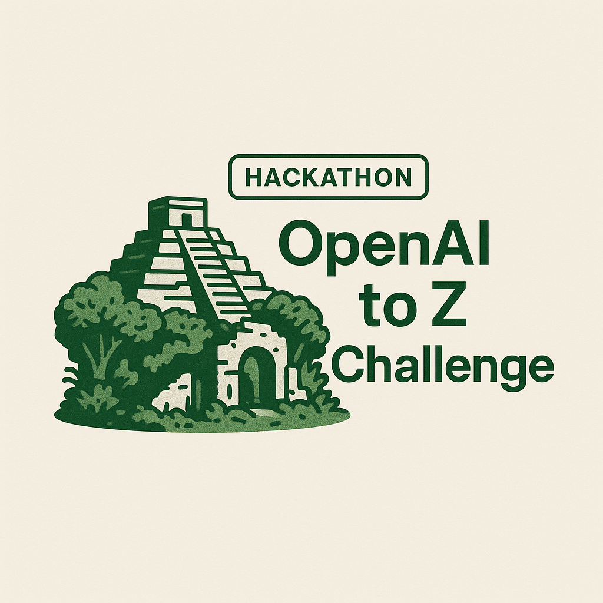
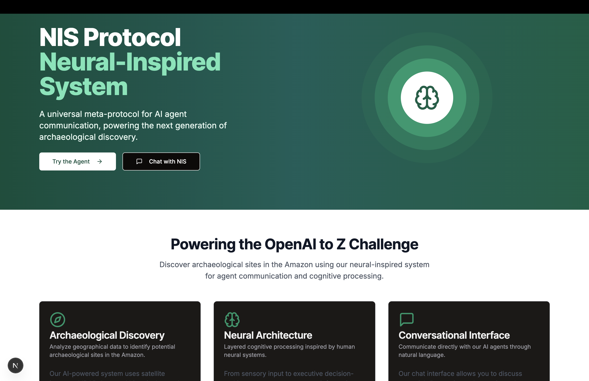

# 🌿 OpenAI to Z Challenge: NIS Protocol - Unveiling Amazon's Hidden Histories

<div align="center">
  
</div>

## 🚀 Project Vision

Embark on a groundbreaking journey to rewrite archaeological understanding of the Amazon rainforest using cutting-edge AI and interdisciplinary research.

## 🧠 The NIS Protocol: Bridging Technology and Ancient Wisdom

### Our Mission
Discover forgotten civilizations by harmonizing:
- 🛰️ Satellite Imagery
- 📡 LIDAR Technology
- 📜 Colonial Texts
- 🌿 Indigenous Knowledge

## 🤖 Intelligent Agent Architecture

Our Neuro-Inspired System (NIS) Protocol deploys a sophisticated multi-agent ecosystem:

| Agent | Specialization | Key Capability |
|-------|----------------|----------------|
| 👁️ Vision Agent | Data Processing | Anomaly Detection in Imagery |
| 🧠 Memory Agent | Contextual Retrieval | Historical Data Integration |
| 💡 Reasoning Agent | Analytical Intelligence | Site Probability Assessment |
| 🌍 Action Agent | Strategic Output | Comprehensive Reporting |

## 🔧 Technical Ecosystem

- **Backend**: FastAPI
- **Frontend**: Next.js with shadcn/ui
- **AI Models**: GPT-4.1, YOLOv8/WALDO
- **Mapping**: Leaflet Interactive Maps

## 🌈 Key Differentiators

- **Interdisciplinary Approach**: Combining AI with anthropological research
- **Ethical Technology**: Respecting and amplifying indigenous knowledge
- **Cutting-Edge Methodology**: State-of-the-art AI meets archaeological exploration

## 🚀 Quick Start

### Prerequisites
- 🐍 Python 3.9+
- 📦 Node.js 18+
- 🔧 Git

### Setup in 3 Simple Steps

1. **Clone the Repository**
   ```bash
   git clone https://github.com/yourusername/openai-to-z-nis.git
   cd openai-to-z-nis
   ```

2. **Backend Setup**
   ```bash
   python -m venv venv
   source venv/bin/activate
   pip install -r requirements.txt
   ```

3. **Frontend Launch**
   ```bash
   cd frontend
   npm install
   npm run dev
   ```

## 🌍 Explore & Discover

1. Navigate to `http://localhost:3000`
2. Select your research area
3. Choose data sources
4. Click "Run Agent"
5. Uncover hidden archaeological treasures!

## 🤝 Collaborative Innovation

**Calling All Explorers, Researchers, and Tech Enthusiasts!**

We believe in the power of collaborative discovery. Whether you're an archaeologist, data scientist, or passionate about preserving human history, there's a place for you in this project.

### How to Contribute
- 🍴 Fork the repository
- 🌿 Create a feature branch
- 💡 Commit your innovations
- 🚀 Submit a pull request

## 📄 Licensing

Distributed under the MIT License. See `LICENSE` for more information.

## 🙏 Acknowledgements

- OpenAI for the transformative GPT-4.1 model
- Earth Archive for comprehensive LIDAR data
- Indigenous communities of the Amazon - the true guardians of this knowledge

---

<div align="center">
  <strong>Rewriting History, One AI-Powered Discovery at a Time 🕵️‍♀️🌴</strong>
</div>

## Project Overview

This project leverages the NIS (Neuro-Inspired System) Protocol to discover potential archaeological sites in the Amazon rainforest. By integrating satellite imagery, LIDAR data, colonial texts, and indigenous knowledge with state-of-the-art AI models, we aim to uncover previously unknown archaeological sites that could rewrite our understanding of pre-Columbian civilizations in the Amazon.

## Architecture

The NIS Protocol is a biologically inspired multi-agent architecture that coordinates various AI agents:

- **Vision Agent**: Processes raw data (satellite images, LIDAR scans) to detect anomalies or structures
- **Memory Agent**: Stores and retrieves contextual information (previous findings, historical texts)
- **Reasoning Agent**: Analyzes inputs using GPT-4.1 to determine the likelihood of archaeological sites
- **Action Agent**: Produces final outputs (compiled reports, map markers, recommendations)

These agents communicate via the MetaProtocolCoordinator, which implements three protocols:
- **MCP** (Managed Compute Protocol): For orchestrating external API calls
- **ACP** (Agent Communication Protocol): For structured agent function calls
- **A2A** (Agent-to-Agent Protocol): For direct peer-to-peer agent communication


## Project Setup

### Prerequisites

- Python 3.9+
- Node.js 18+
- Git

### Backend Setup

1. Clone the repository:
```bash
git clone https://github.com/yourusername/openai-to-z-nis.git
cd openai-to-z-nis
```

2. Create and activate a virtual environment:
```bash
# On Windows
python -m venv venv
.\venv\Scripts\activate

# On macOS/Linux
python -m venv venv
source venv/bin/activate
```

3. Install backend dependencies:
```bash
pip install -r requirements.txt
```

4. Create necessary directories:
```bash
mkdir -p data/lidar data/satellite data/colonial_texts data/overlays
mkdir -p outputs/findings outputs/logs outputs/memory
```

5. Set up environment variables:
Create a `.env` file in the project root with the following:
```
OPENAI_API_KEY=your_openai_api_key
```

### Frontend Setup

1. Install frontend dependencies:
```bash
cd frontend
npm install
```

### Running the Application

#### Running the API Server

```bash
# From the project root
python run_api.py
```

The API will be available at http://localhost:8000

#### Running the Frontend

In a separate terminal:
```bash
# From the frontend directory
cd frontend
npm run dev
```

The frontend will be available at http://localhost:3000

### Troubleshooting npm issues in Git Bash

If you experience issues with npm in Git Bash, try using PowerShell instead:

1. Open PowerShell and navigate to the frontend directory:
```powershell
cd C:\path\to\openai-to-z-nis\frontend
```

2. Install dependencies and run the development server:
```powershell
npm install
npm run dev
```

## Using the Application

1. Open your web browser and navigate to http://localhost:3000
2. Enter coordinates or select a preset location
3. Select the data sources you want to use (satellite, LIDAR, historical texts, indigenous maps)
4. Click "Run Agent" to start the analysis
5. View results in the "Results" tab and explore the map in the "Map" tab

## Data Sources

- **Satellite Imagery**: Sentinel-2 multispectral imagery
- **LIDAR Data**: Earth Archive tiles for selected regions
- **Historical Texts**: Colonial records, missionary accounts, and expedition journals
- **Indigenous Knowledge**: Oral traditions and cultural maps from local communities

## Implementation Details

The project is built with:
- **Backend**: FastAPI for the API server
- **Frontend**: Next.js with shadcn/ui components
- **Map Integration**: Leaflet for interactive maps
- **AI Models**: GPT-4.1 for reasoning, YOLOv8/WALDO for computer vision

The NIS Protocol architecture ensures seamless communication between agents, with the MetaProtocolCoordinator managing the flow of information and preserving context across different processing steps.

## Directory Structure

```
openai-to-z-nis/
├── data/                      # Raw data sources
│   ├── lidar/                 # LIDAR tiles
│   ├── satellite/             # Satellite imagery
│   ├── colonial_texts/        # Historical text sources
│   └── overlays/              # Generated overlay images
├── src/
│   ├── agents/                # Agent implementations
│   │   ├── vision_agent.py      # Vision Agent
│   │   ├── memory_agent.py      # Memory Agent
│   │   ├── reasoning_agent.py   # Reasoning Agent
│   │   └── action_agent.py      # Action Agent
│   ├── meta/                  # MetaProtocol implementation
│   │   └── coordinator.py       # MetaProtocolCoordinator
│   ├── prompts/               # Prompt templates for GPT-4.1
│   └── utils/                 # Utility modules
├── api/                       # API endpoints and integrators
├── frontend/                  # Next.js frontend
│   ├── components/            # React components
│   └── ...
├── outputs/                   # Analysis outputs
│   ├── findings/              # Discovered site reports
│   ├── logs/                  # Log files
│   └── memory/                # Agent memory persistence
├── run_api.py                 # Script to run the API server
└── README.md                  # Project documentation
```

## Contributing

1. Fork the repository
2. Create a feature branch: `git checkout -b feature/your-feature`
3. Commit your changes: `git commit -am 'Add your feature'`
4. Push to the branch: `git push origin feature/your-feature`
5. Submit a pull request

## License

This project is licensed under the MIT License - see the LICENSE file for details.

## Acknowledgements

- OpenAI for the GPT-4.1 model and the OpenAI to Z Challenge
- Earth Archive for LIDAR data
- Indigenous communities of the Amazon region for their knowledge and perspectives

## 🖥️ Frontend Showcase

<div align="center">
  
</div>

### Frontend Features
- 🎨 Modern, clean design with a focus on user experience
- 🧠 Intuitive interface for archaeological discovery
- 🌍 Interactive exploration of potential archaeological sites
- 🤖 Direct interaction with AI agents

### User Experience
- **Try the Agent**: Quickly start your archaeological exploration
- **Chat with NIS**: Engage directly with our neural-inspired system
- **Discover Hidden Histories**: Uncover archaeological sites in the Amazon 