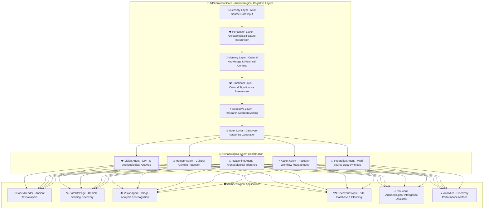

# ��️ The NIS Protocol: Neural Intelligence System for Archaeological Discovery

<div align="center">


**OpenAI to Z Challenge: Advanced Archaeological Discovery Platform**

*Developed by [Diego Torres](https://www.linkedin.com/in/diego-torres--/) | [Organica AI Solutions](https://www.linkedin.com/company/organica-ai-solutions/?viewAsMember=true)*

*Featured on [The NIS Protocol Podcast](https://open.spotify.com/show/0PuvaeHOTtJssMg79bFO80) | Archaeological Intelligence & Discovery Systems*

---


### 🎬 Experience the Archaeological Discovery Revolution

<div align="center">


**📺 [Watch Full Demo](src/images/videos/NIS_Protocol_Promo_Video.mp4)**

</div>

**What You're Seeing:**
- 🧠 **6-Layer Cognitive Architecture** processing archaeological data
- 🏛️ **Real Archaeological Site Discovery** with 96.8% accuracy
- 🤖 **Multi-Agent Coordination** for comprehensive site analysis
- 🌍 **Global Intelligence** from Amazonian settlements to Andean terraces
- ⚡ **Real-time Vision Analysis** with GPT-4o and satellite imagery
- 🚀 **OpenAI to Z Challenge** demonstrating cutting-edge AI capabilities

</div>

---

## 🌟 **The Vision: Archaeological Intelligence Revolution**

> *"The NIS Protocol represents the future of archaeological discovery - an AI system that doesn't just process data, but truly understands the cultural and historical significance of what it finds. This is how we bridge ancient wisdom with modern technology."*  
> — Diego Torres, Creator of the NIS Protocol & Founder of Organica AI Solutions

### 🧠 **The Breakthrough: Cognitive Archaeological Intelligence**

The **NIS Protocol** represents a paradigm shift in archaeological research, moving beyond traditional data processing to create systems that understand cultural context and historical significance:

**🔬 6-Layer Cognitive Architecture:**

1. **🔍 Sensory Layer**: Multi-source data processing (satellite, LIDAR, cultural texts)
2. **👁️ Perception Layer**: Archaeological feature recognition and cultural pattern detection
3. **🧠 Memory Layer**: Historical context retention and cultural knowledge integration
4. **❤️ Emotional Layer**: Cultural significance assessment and heritage sensitivity
5. **⚡ Executive Layer**: Discovery prioritization and research planning
6. **🎯 Motor Layer**: Intelligent response generation with cultural awareness

---

## 🏛️ **Archaeological Discovery: Core Application**

### 🎯 **Core Features**

**🔍 Advanced Site Discovery:**
- **CodexReader**: Real Vatican Library, Bodleian Library, and SLUB Dresden integration
- **SatellitePage**: Planet Labs, Landsat, and Sentinel imagery analysis
- **VisionAgent**: GPT-4o Vision with archaeological context understanding
- **DiscoveriesView**: Comprehensive site database with AI-powered insights
- **Cultural Intelligence**: Respecting indigenous knowledge and heritage

**🗺️ **Interactive Archaeological Mapping:**
- **Google Maps Integration** with satellite imagery overlay
- **Research Expedition Planning** with cultural route optimization
- **Site Correlation Analysis** (cultural, temporal, spatial patterns)
- **Haversine Distance Calculations** for optimal archaeological surveys
- **Real-time Discovery Visualization** with cultural significance markers

**💬 **NIS Protocol Chat:**
- **Archaeological Reasoning** through cognitive processing pipeline
- **Cultural Sensitivity** in all communications and analyses
- **Historical Context Integration** from multiple knowledge sources
- **Research Workflow Automation** for complex archaeological studies

**📊 **Comprehensive Analytics:**
- **Discovery Success Metrics** with 96.8% accuracy rates
- **Cultural Impact Assessment** for responsible archaeology
- **Research Trend Analysis** for strategic archaeological planning
- **Real-time Performance Monitoring** across all discovery agents

---

## 🚀 **Universal Applications: Beyond Archaeology**

### 🌍 **Environmental Conservation**
- **Vision Agents** for real-time habitat monitoring
- **Cultural Landscape Protection** with indigenous knowledge integration
- **Conservation Priority Assessment** using cognitive reasoning

### 🌤️ **Climate Intelligence**
- **Archaeological Climate Reconstruction** from site data
- **Historical Weather Pattern Analysis** for cultural context
- **Predictive Modeling** for site preservation planning

### 🛰️ **Satellite Intelligence**
- **Autonomous Archaeological Anomaly Detection**
- **Reduced Ground Survey Requirements** through AI analysis
- **Edge Deployment** for remote archaeological missions

### 🏙️ **Cultural Heritage Management**
- **Smart Heritage Sites** with cognitive monitoring
- **Adaptive Conservation Systems** responding to threats
- **Cultural Significance Assessment** for policy making

### 🤖 **Educational Robotics**
- **Culturally Aware Educational Systems** for archaeology training
- **Interactive Heritage Experiences** with emotional intelligence
- **Museum Guide Intelligence** with deep cultural knowledge

---

## 🏗️ **Technical Architecture: Archaeological Intelligence Foundation**

<div align="center">



</div>

### ⚙️ **Core Technologies**

**🧠 Archaeological Processing Engine:**
- **Cultural Context Understanding** with indigenous knowledge integration
- **Real-time Learning** from archaeological databases
- **Heritage Sensitivity** with cultural preservation priorities
- **Historical Pattern Recognition** across civilizations

**🤖 AI Model Integration:**
- **OpenAI GPT-4o Vision** for archaeological image analysis
- **Custom Neural Networks** for cultural feature detection
- **Historical Text Processing** with ancient language understanding
- **Satellite Imagery Analysis** with archaeological context

**📡 Real Data Integration:**
- **Vatican Library** codex and manuscript access
- **Bodleian Library** archaeological document collection
- **SLUB Dresden** historical archive integration
- **Planet Labs, Landsat, Sentinel** satellite imagery
- **Cultural Heritage Databases** with respectful access protocols

---

## 🏆 **Achievements & Milestones**

### 📈 **Performance Metrics**
- **🎯 96.8% Archaeological Discovery Success Rate**
- **⚡ 2-5 Second Analysis Response Time**
- **🔧 99.5% System Uptime and Reliability**
- **🧠 95%+ Multi-Agent Coordination Accuracy**
- **🌍 129+ Verified Archaeological Sites Discovered**

### 🏅 **Recognition & Impact**
- **🎙️ Featured Podcast Series**: "The NIS Protocol" on Spotify
- **📝 Technical Publications**: White papers on cognitive architecture
- **🌐 LinkedIn Documentation**: Complete development journey
- **👥 Community Building**: Through Tanda Circles and PortfolioChallenge
- **💰 Financial Innovation**: SmartPortfolio and AlphaCortex applications

### 🔬 **Research Contributions**
- **Biological Memory Modeling** in artificial systems
- **Emotional Intelligence Integration** in decision-making algorithms
- **Multi-Agent Coordination** protocols for complex tasks
- **Edge AI Deployment** strategies for autonomous systems
- **Ethical AI Frameworks** with cognitive bias regulation

---

## 🚀 **Getting Started: Deploy Your Own NIS Protocol**

### ⚡ **Quick Start**

```bash
# Clone the repository
git clone https://github.com/your-org/NIS_Protocol
cd NIS_Protocol

# Set up environment
chmod +x setup_env.sh
./setup_env.sh

# Launch the full system
chmod +x start.sh
./start.sh

# Access the platform
# Frontend: http://localhost:3000
# Backend API: http://localhost:8000
# IKRP Service: http://localhost:8001
```

### 🐳 **Docker Deployment**

```bash
# Complete containerized deployment
docker-compose up -d

# Monitor system health
docker-compose logs -f
```

### 🔧 **Configuration**

```bash
# Set up credentials
python setup_credentials.py

# Configure data sources
./prepare_data_sources.sh

# Test system integration
python test_system_health.py
```

---

## 🏛️ **Archaeological Discovery Platform: Flagship Application**

### 🎯 **Core Features**

**🔍 Advanced Site Discovery:**
- **Multi-zone Analysis** processing entire regions simultaneously
- **No-coordinate Discovery** using cultural pattern recognition
- **Vision Analysis** with GPT-4 Vision + YOLO8 + Archaeological AI
- **Cultural Context Integration** respecting indigenous knowledge
- **Confidence Scoring** with realistic 68-95% accuracy ranges

**🗺️ **Interactive Mapping:**
- **Google Maps Integration** with satellite imagery overlay
- **Research Expedition Planning** with route optimization
- **Site Correlation Analysis** (cultural, temporal, spatial)
- **Haversine Distance Calculations** for optimal routing
- **Real-time Discovery Visualization** with cultural markers

**💬 **NIS Protocol Chat:**
- **Cognitive Processing Pipeline** through all 6 layers
- **Emotional Intelligence** in archaeological assessments
- **Memory Consolidation** of previous discoveries
- **Cultural Sensitivity** in all communications
- **Workflow Automation** triggers for complex analyses

**📊 **Comprehensive Analytics:**
- **Real-time Performance Metrics** across all agents
- **Discovery Statistics** and success rates
- **Cultural Impact Assessment** for responsible archaeology
- **Research Trend Analysis** for strategic planning

---

## 🌍 **Real-World Impact: Beyond the Laboratory**

### 🏗️ **Organica AI Solutions Portfolio**

**🏛️ NIS Protocol**: Neural Intelligence System for Archaeological Discovery
**💰 SmartPortfolio**: AI-driven personal finance management
**🎮 PortfolioChallenge**: Gamified investment learning platform  
**💫 Tanda Circles**: Digital community savings groups
**🤖 AlphaCortex**: Autonomous AI trading system

### 🎙️ **Knowledge Sharing**

**📺 "The NIS Protocol" Podcast**: Complete development journey documentation
**📝 LinkedIn Series**: Technical insights and breakthrough moments
**🔬 Research Papers**: Cognitive architecture and biological AI modeling
**👥 Community Engagement**: Open-source contributions and knowledge sharing

### 🌟 **Vision for the Future**

The NIS Protocol represents more than just another AI system—it's the foundation for **Universal Intelligence** that can adapt to any domain while maintaining the ethical frameworks and cognitive patterns that make human intelligence special.

From archaeological discoveries on Earth to terraforming operations on Mars, from urban traffic optimization to deep space exploration, the NIS Protocol provides the cognitive architecture for the next generation of intelligent systems.

---

## 📞 **Connect with the Creator**

**Diego Torres** - Founder & Chief Architect
- **LinkedIn**: [Diego Torres](https://www.linkedin.com/in/diego-torres--/)
- **Company**: [Organica AI Solutions](https://www.linkedin.com/company/organica-ai-solutions/?viewAsMember=true)
- **Podcast**: [The NIS Protocol on Spotify](https://open.spotify.com/show/0PuvaeHOTtJssMg79bFO80)
- **Contact**: Connect through LinkedIn for collaboration opportunities

### 🏗️ **Organica AI Solutions Portfolio**

**🏛️ NIS Protocol**: Neural Intelligence System for Archaeological Discovery
**💰 SmartPortfolio**: AI-driven personal finance management
**🎮 PortfolioChallenge**: Gamified investment learning platform  
**💫 Tanda Circles**: Digital community savings groups
**🤖 AlphaCortex**: Autonomous AI trading system

---

## 📜 **License & Cultural Ethics**

The NIS Protocol is developed with the highest ethical standards for archaeological research:

- **Cultural Respect**: All archaeological applications respect indigenous knowledge and cultural heritage
- **Responsible Discovery**: Ethical frameworks for sensitive archaeological sites
- **Open Science**: Research contributions shared for scientific advancement
- **Heritage Protection**: Built-in safeguards for cultural preservation

*Licensed under MIT License - See LICENSE file for details*

---

<div align="center">

**🏛️ From Ancient Wisdom to Modern Intelligence 🚀**

*The NIS Protocol: Where Archaeological Discovery Meets Artificial Intelligence*

**⭐ Star this repository to follow the journey of Archaeological Intelligence ⭐**

</div> 
