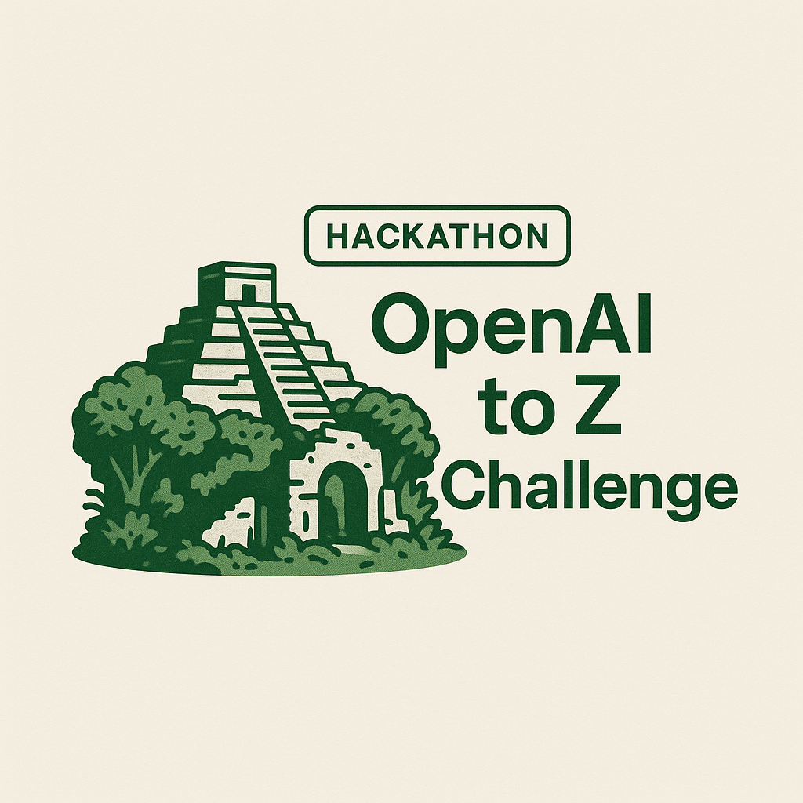

# OpenAI to Z Challenge - NIS Protocol

<p align="center">
  
</p>

## Amazon Archaeological Site Discovery

### Overview
This project leverages the NIS Protocol (Neuro-Inspired System) to discover potential archaeological sites in the Amazon rainforest using multi-modal AI analysis of satellite imagery, LIDAR data, colonial texts, and indigenous knowledge.

Developed for the OpenAI to Z Challenge, our goal is to use AI to identify previously unknown archaeological sites within the Amazon biome of Northern South America, focusing on Brazil with extensions into Bolivia, Colombia, Ecuador, Guyana, Peru, Suriname, Venezuela, and French Guiana.

### About the Challenge
The OpenAI to Z Challenge invites participants to bring legends to life by discovering previously unknown archaeological sites using open-source data and AI. The Amazon rainforest, spanning over 6,000,000 sq km across nine countries, holds untold histories of past civilizations and is home to numerous Indigenous groups. Resources like satellite imagery and LIDAR are helping to fill gaps in our understanding of this previously unexplored region.

Legends such as the "lost city of Z", Paititi, and El Dorado hint at dense ancient civilizations waiting to be discovered. Our project seeks to contribute to this exploration using cutting-edge AI technology.

### Key Features
- Multi-agent AI system using our custom NIS Protocol
- Integration of satellite imagery and LIDAR data
- Analysis of historical colonial texts
- Respect for indigenous knowledge and oral histories
- Interactive web frontend for exploration and verification

### NIS Protocol Architecture
Our Neuro-Inspired System (NIS) consists of specialized agents working together:
- **Vision Agent**: Processes satellite and LIDAR data to detect anomalies
- **Memory Agent**: Stores and retrieves contextual information
- **Reasoning Agent**: Analyzes findings and connects evidence
- **Action Agent**: Generates outputs and recommendations

<p align="center">
  
</p>

### Getting Started

#### Prerequisites
- Python 3.9+
- Node.js 18+
- Git

#### Installation

```bash
# Clone the repository
git clone https://github.com/yourusername/openai-to-z-nis.git
cd openai-to-z-nis

# Install backend dependencies
pip install -r requirements.txt

# Install frontend dependencies
cd frontend
npm install
cd ..
```

#### Running the API Server

```bash
# Run the API server
python run_api.py
```

The API server will start on http://localhost:8000 by default. You can test the API by visiting:
- API documentation: http://localhost:8000/docs
- Health check: http://localhost:8000/health

#### Using the API

The main endpoint is `/analyze`, which accepts a POST request with coordinates and data source preferences:

```json
{
  "coordinates": "-3.4653, -62.2159",
  "dataSources": {
    "satellite": true,
    "lidar": true,
    "historicalTexts": true,
    "indigenousMaps": true
  }
}
```

#### Running the Frontend

```bash
# In a separate terminal, run the frontend
cd frontend
npm run dev
```

Visit `http://localhost:3000` to access the NIS Protocol interface.

### Data Sources
- Earth Archive LIDAR data
- Sentinel-2 satellite imagery
- Historical colonial texts from digitized archives
- Published archaeological surveys
- Indigenous knowledge maps (with proper attribution)

### Research Methodology
Our approach combines computer vision techniques with natural language processing and historical context analysis:

1. **Data Collection**: We gather satellite imagery, LIDAR data, colonial texts, and indigenous knowledge
2. **Anomaly Detection**: Our Vision Agent identifies potential structures and patterns
3. **Contextual Analysis**: The Reasoning Agent connects visual findings with historical records
4. **Verification**: Multiple sources are used to verify each potential discovery
5. **Documentation**: Findings are thoroughly documented with coordinates, confidence scores, and supporting evidence

### Future Directions
- Expand coverage to more remote regions of the Amazon
- Incorporate additional data sources and sensing technologies
- Develop collaborations with local archaeological teams
- Create open datasets for the archaeological research community

### License
MIT

### Acknowledgements
This project is submitted as part of the OpenAI to Z Challenge. We thank the Earth Archive for providing LIDAR data and acknowledge the traditional knowledge of indigenous communities of the Amazon region. 


##developerNote
Data Processing
Could benefit from more sophisticated image processing algorithms
Might need better handling of large LIDAR datasets
Could improve the integration of indigenous knowledge
Scalability
The current implementation might face challenges with large-scale analysis
Could benefit from distributed processing for multiple areas
Might need optimization for real-time processing
Validation
Field verification of findings is still needed
Could benefit from more collaboration with archaeological experts
Might need more robust validation methods